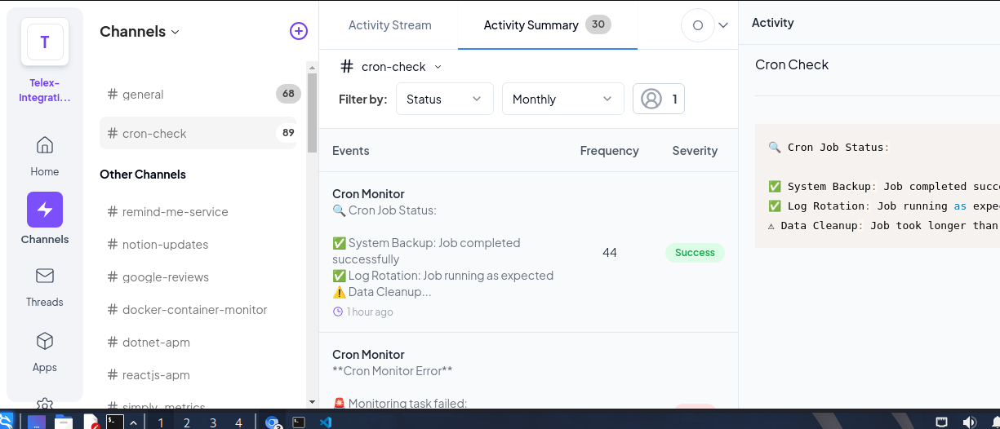

# Cron Job Monitor

A FastAPI-based service that monitors cron jobs by checking their log files and process status. The service can be deployed to platforms like Render or Vercel and integrates with webhook notifications.

## Features

- Monitor multiple cron jobs simultaneously
- Check job execution status and duration
- Process monitoring to detect running jobs
- Webhook notifications for status updates
- Support for multiple log timestamp formats
- Easy deployment to cloud platforms

## Installation

1. Clone the repository:
```bash
git clone https://github.com/yourusername/cron-job-monitor.git
cd cron-job-monitor
```

2. Create a virtual environment and install dependencies:
```bash
python -m venv venv
source venv/bin/activate  # On Windows use: venv\Scripts\activate
pip install -r requirements.txt
```

## Requirements

Create a `requirements.txt` file with the following dependencies:

```
fastapi==0.104.1
uvicorn==0.24.0
httpx==0.25.1
pydantic==2.4.2
python-multipart==0.0.6
```

## Usage

### Running Locally

```bash
uvicorn app:app --reload --port 8000
```

### Testing with cURL

1. Basic health check:
```bash
curl http://localhost:8000/
```

2. Monitor cron jobs:
```bash
curl -X POST http://localhost:8000/monitor \
  -H "Content-Type: application/json" \
  -d '{
    "jobs": [
      {
        "name": "Daily Backup",
        "pattern": "backup.sh",
        "max_duration": 120,
        "log_file": "/var/log/cron/backup.log",
        "expected_output": "Backup completed successfully"
      }
    ],
    "webhook_url": "https://your-webhook-url.com/endpoint"
  }'
```
# Cron Job Monitor

    This application provides real-time monitoring of cron jobs and system metrics.

    ## Screenshot

    

    ## Features

    * Real-time cron job status updates
    * Dynamic system metrics display
    * Intelligent insights and alerts
## Deployment

### Deploying to Render

1. Create a new Web Service in Render
2. Connect your GitHub repository
3. Use the following build settings:
   - Build Command: `pip install -r requirements.txt`
   - Start Command: `uvicorn app:app --host 0.0.0.0 --port $PORT`

### Deploying to Vercel

1. Create a `vercel.json` file:
```json
{
  "version": 2,
  "builds": [
    {
      "src": "app.py",
      "use": "@vercel/python"
    }
  ],
  "routes": [
    {
      "src": "/(.*)",
      "dest": "app.py"
    }
  ]
}
```

2. Deploy using Vercel CLI:
```bash
vercel
```

## API Response Format

Successful response structure:
```json
{
  "status": "success",
  "results": [
    {
      "name": "Daily Backup",
      "status": "ok",
      "message": "Last run completed in 5.7 minutes",
      "running": true,
      "last_check": "2024-02-20T10:00:00.000Z"
    }
  ],
  "timestamp": "2024-02-20T10:00:00.000Z"
}
```

## Error Handling

The API returns appropriate HTTP status codes:
- 200: Successful request
- 400: Invalid request parameters
- 500: Server error

Error response structure:
```json
{
  "detail": "Error message description"
}
```

## Contributing

1. Fork the repository
2. Create a feature branch
3. Commit your changes
4. Push to the branch
5. Create a Pull Request

## License

This project is licensed under the MIT License - see the LICENSE file for details.